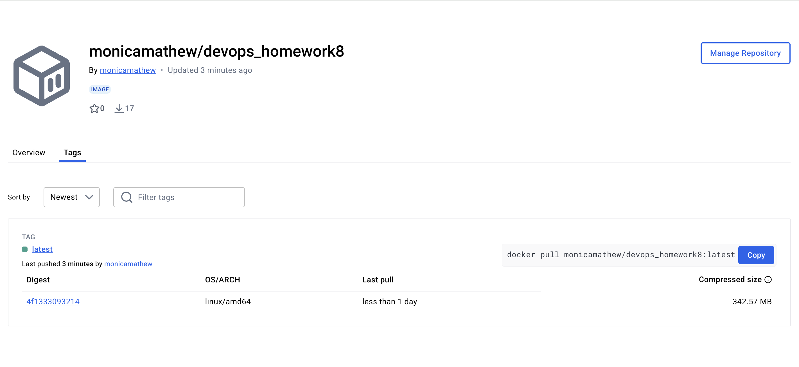

# Devops - Automated Builds Pushing to Dockeruhub Intro

GitHub Action to implement a CI/CD workflow to automaticly test, build and push your program's image to Dockerhub. 

## Instructor Videos:

1. [Important Docker Commands to Know](https://youtu.be/B26ecGh8tMw)
2. [Automated Builds Complete Demo](https://youtu.be/PZVT1IOC0Zo)

## Screenshots

1.  Put the screenshot of your image in your Docker account here.

## Docker Link
1. Docker link - https://hub.docker.com/r/monicamathew/devops_homework8/tags
